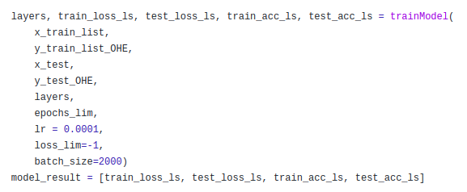

# Image Classification on CIFAR-10 using Deep Learning Neural Networks

Drexel University, Philadelphia, PA

Course: CS615 - Deep Learning

Date: September 2, 2022

Team member:

| Name | Maissoun Ksara | Khiem Nguyen | Tien Nguyen | Chris Oriente |
| --- | --- | --- | --- | --- |
| Email | mk3272@drexel.edu | ktn44@drexel.edu | thn44@drexel.edu | co449@drexel.edu |

In this project, we implemented deep learning neural networks without using deep learning libraries to classify images of the CIFAR-10 data set. We used 2 deep learning architectures:

- Multi-layer Perceptron Model
- Convolutional Neural Network (LeNet)

## Install dependencies

Python3 and Pip is required to install the dependencies.

```bash
pip install -r requirements.txt
```

## Train and evaluate the Multi-layer Perceptron Model

```bash
python3 mlp_allbatches.py
```

The result is placed in the folder mlp_figures.  
Note: in order to tune the hyper-parameters of MLP Model, one would need to change the value of the parameters in the script accordingly in the MLP() method.



## Train and evaluate the Convolutional Neural Network (LeNet) Model 1

```bash
python3 lenet.py
```

The result is placed in the folder lenet_figures

## Train and evaluate the Convolutional Neural Network (LeNet) Model 2

```bash
python3 lenet_dropout.py
```

The result is placed in the folder lenet_figures
